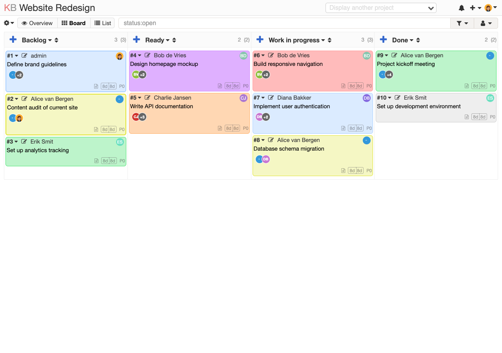
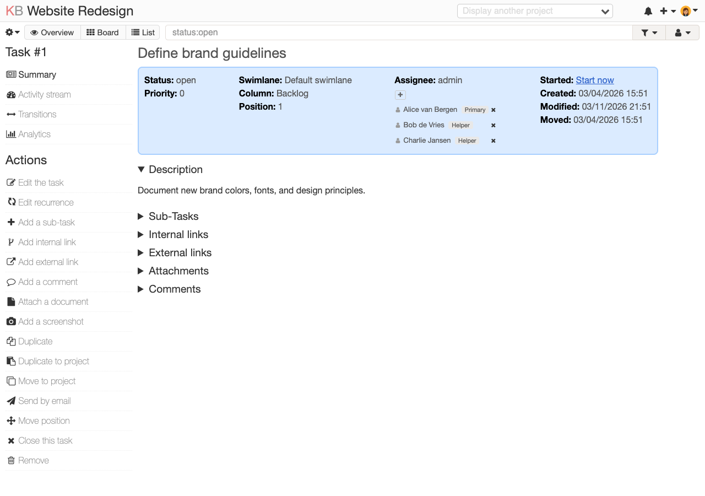
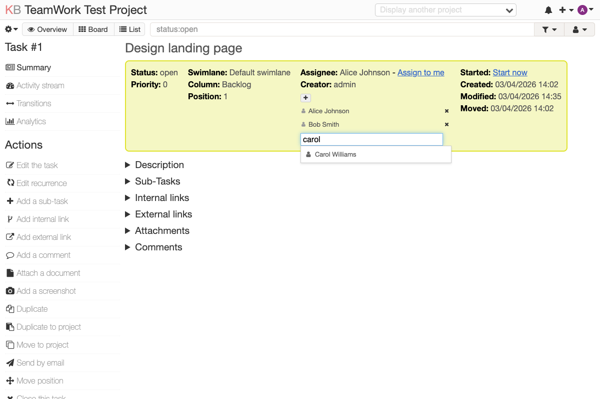
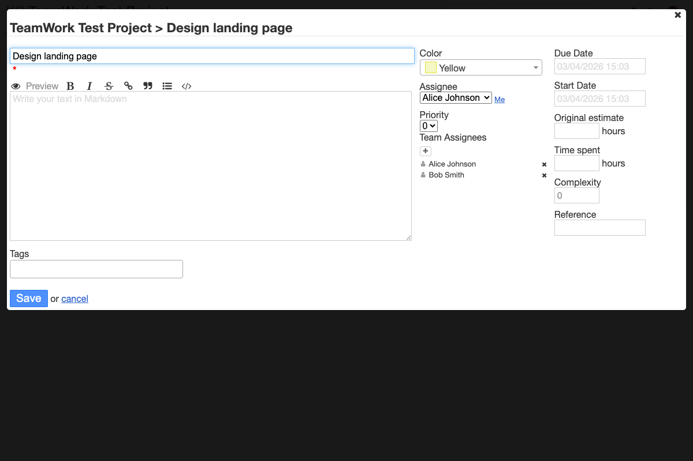
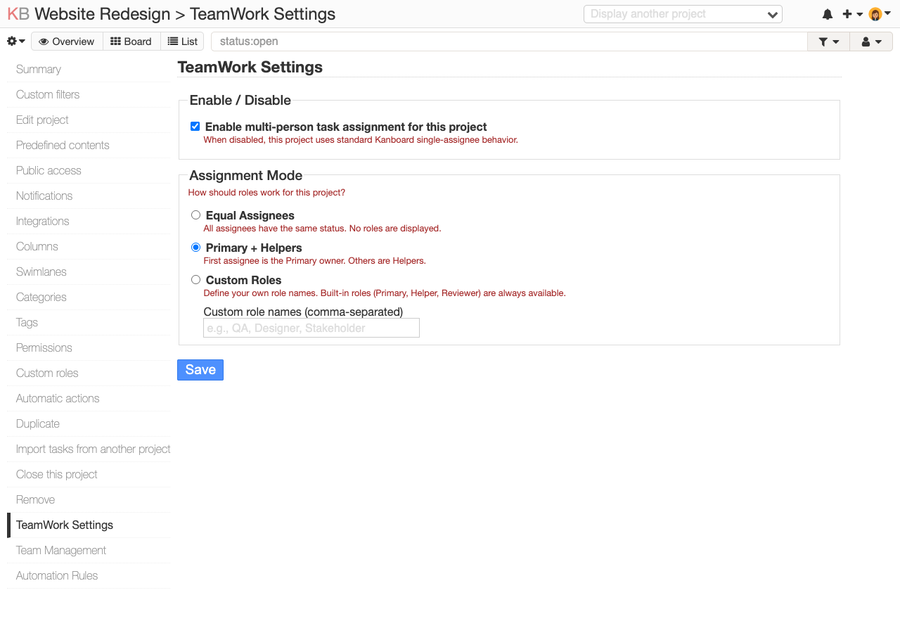

# TeamWork - Multi-Person Task Assignment for Kanboard

Assign multiple users, groups, and teams to any task in [Kanboard](https://kanboard.org). TeamWork extends Kanboard's native single-assignee model with a full multi-assignee workflow, visible everywhere: on the board, in task detail views, and in the task edit modal. The plugin can be enabled or disabled per project, so teams that only need single-assignee behavior are not affected.

## Screenshots

### Board View - Avatar Stacks
Each task card on the board shows colored avatar circles for all assigned team members, with a "+N" overflow indicator when there are more than two.



### Task Detail Page
The task detail page shows a complete assignee list below the native assignee field, with a [+] button to add more people.



### Search Picker
Click [+] to open the type-ahead search. Start typing a name to filter users, groups, and teams. Click a result to assign them instantly.



### Edit Modal (Card Popup)
When you click the edit icon on a board card, the popup includes a "Team Assignees" section so you can manage assignees without leaving the board.



### TeamWork Settings
Enable or disable multi-person assignment per project, and choose how roles work: equal status, primary + helpers, or fully custom roles.



---

## Features

### Per-Project Enable/Disable
- **Enable or disable** TeamWork independently for each project
- When disabled, the project uses standard Kanboard single-assignee behavior
- No avatar stacks, no team assignee sections, no extra sidebar links — just vanilla Kanboard
- Enabled by default so existing installations keep working

### Multi-Assignee Management
- **Assign users** individually via a type-ahead search picker
- **Assign groups** (Kanboard native groups) - all members are added at once
- **Assign teams** (plugin-defined project teams) - create reusable teams per project
- **Remove** individual assignees, entire groups, or entire teams with one click

### Board Integration
- **Avatar stacks** on every task card showing assigned members with colored initials
- **Overflow indicator** (+N) when a task has more than two assignees
- **Edit modal widget** - manage assignees directly from the board card popup

### Role-Based Assignments
Three assignment modes per project:
- **Equal Assignees** - everyone has equal status (default)
- **Primary + Helpers** - first assignee is Primary, others are Helpers
- **Custom Roles** - define your own roles (QA, Designer, Stakeholder, etc.)

Roles are clickable - click a role label to change it via an inline dropdown.

### Team Management
- Create reusable **project teams** from the project settings sidebar
- Add/remove team members with a search interface
- Assign an entire team to a task in one click

### Automation Rules
- **Auto-assign** users or teams when a task moves to a specific column
- Example: automatically assign the "QA Team" when a task moves to "Ready for Review"

### Notifications
- Multi-assignees receive notifications for task updates, comments, subtask changes, and more
- Assignee add/remove events trigger notifications to affected users

### Search & Filtering
- Extended `assignee:` search filter includes TeamWork assignees (not just the native owner)
- New `role:` filter to find tasks by assignee role (e.g., `role:Primary`)
- Works in board filters and the global search bar

### Dashboard Integration
- Tasks where you are a TeamWork assignee appear on your personal dashboard
- Works alongside the native "assigned to me" tasks

---

## Installation

### Option 1: Download & Extract (Recommended)

1. Download the latest release from the [Releases page](https://github.com/k1bot2026/kanboard-plugin-teamwork/releases) or clone the repository:
   ```bash
   cd /path/to/kanboard/plugins
   git clone https://github.com/k1bot2026/kanboard-plugin-teamwork.git TeamWork
   ```

2. Make sure the plugin folder is named **`TeamWork`** (case-sensitive):
   ```
   plugins/
     TeamWork/
       Plugin.php
       ...
   ```

3. Open Kanboard in your browser. The plugin will be detected automatically and the database tables will be created on first load.

4. Verify installation: go to **Settings > Plugins** in Kanboard. You should see "TeamWork" listed.

### Option 2: Docker

If you run Kanboard with Docker, add the plugin to your image:

```dockerfile
FROM kanboard/kanboard:latest
COPY plugins/TeamWork /var/www/app/plugins/TeamWork
```

Then build and run:
```bash
docker build -t kanboard-teamwork .
docker run -d -p 8080:80 -v kanboard_data:/var/www/app/data kanboard-teamwork
```

Or use Docker Compose:
```yaml
services:
  kanboard:
    build: .
    ports:
      - "8080:80"
    volumes:
      - kanboard_data:/var/www/app/data
    restart: unless-stopped

volumes:
  kanboard_data:
```

### Option 3: Manual Upload

1. Download the source code as a ZIP file
2. Extract it into your Kanboard `plugins/` directory
3. Rename the folder to `TeamWork`
4. Refresh Kanboard

---

## Usage

### Adding Assignees to a Task

1. Open any task (click the task title on the board, or click the edit icon)
2. Find the **[+]** button in the assignee section
3. Click it to open the search picker
4. Type a name to search for users, groups, or teams
5. Click a result to assign them to the task

### Managing Assignees

- **Remove a user**: Click the **x** next to their name
- **Remove an entire group/team**: Click the **x** next to the group/team header
- **Change a role**: Click the role label (or "Set role" link) to see the role dropdown
- **Expand group members**: Click the group name to see all members

### Enabling / Disabling TeamWork

1. Go to your project settings (gear icon > project settings)
2. In the sidebar, click **TeamWork Settings**
3. Check or uncheck **Enable multi-person task assignment for this project**
4. Click **Save**

When disabled, all TeamWork features (avatar stacks, team assignees, automation rules) are hidden and the project behaves like standard Kanboard.

### Configuring Assignment Modes

1. Go to your project settings (gear icon > project settings)
2. In the sidebar, click **TeamWork Settings**
3. Choose your preferred mode:
   - **Equal Assignees**: No roles, everyone is equal
   - **Primary + Helpers**: First assignee is Primary, rest are Helpers
   - **Custom Roles**: Define your own role names (comma-separated)
4. Click **Save**

### Creating Project Teams

1. Go to your project settings
2. In the sidebar, click **Team Management**
3. Enter a team name and click **Create**
4. Expand the team and use the search box to add members
5. Teams can now be assigned to tasks just like individual users

### Setting Up Automation Rules

1. Go to your project settings
2. In the sidebar, click **Automation Rules**
3. Select a column and choose who to auto-assign
4. When a task moves to that column, the assignees are added automatically

---

## Compatibility

- **Kanboard**: >= 1.2.46
- **PHP**: >= 7.4
- **Databases**: SQLite, MySQL/MariaDB, PostgreSQL

---

## Project Structure

```
TeamWork/
  Plugin.php                    # Plugin entry point, hooks, and event listeners
  Asset/
    teamwork.css                # All plugin styles
    teamwork.js                 # jQuery behaviors for AJAX interactions
  Controller/
    AssigneeController.php      # Add/remove/search assignees
    SettingsController.php      # Assignment mode configuration
    TeamController.php          # Team CRUD and member management
    AutomationController.php    # Column-move automation rules
  Model/
    TaskAssigneeModel.php       # Assignee data access layer
    TeamModel.php               # Team/member data access
    AutomationRuleModel.php     # Automation rule storage
  Helper/
    BoardAvatarHelper.php       # Batch-loads assignees and renders avatar HTML
  Filter/
    TaskTeamworkAssigneeFilter.php  # Extended assignee: search filter
    TaskTeamworkRoleFilter.php      # New role: search filter
  Subscriber/
    NotificationDispatcher.php  # Fan-out notifications to multi-assignees
  Listener/
    ColumnMoveListener.php      # Fires automation rules on column moves
  Template/
    assignee/show.php           # Assignee UI on task detail page
    assignee/form_widget.php    # Assignee widget in task edit modal
    assignee/picker.php         # Type-ahead search picker
    board/avatar_stack.php      # Avatar circles on board cards
    settings/sidebar.php        # Sidebar links for project settings
    settings/assignment_mode.php # TeamWork settings page (enable/disable + assignment mode)
    team/index.php              # Team management page
    team/members.php            # Team members partial
    automation/index.php        # Automation rules page
  Schema/
    Sqlite.php                  # SQLite migration
    Mysql.php                   # MySQL migration
    Postgres.php                # PostgreSQL migration
  Locale/
    en_US/translations.php      # English translations
```

---

## License

MIT License - see [LICENSE](LICENSE) for details.
