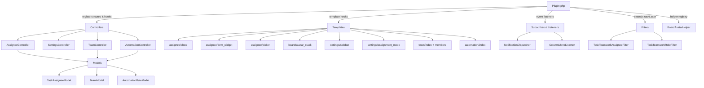
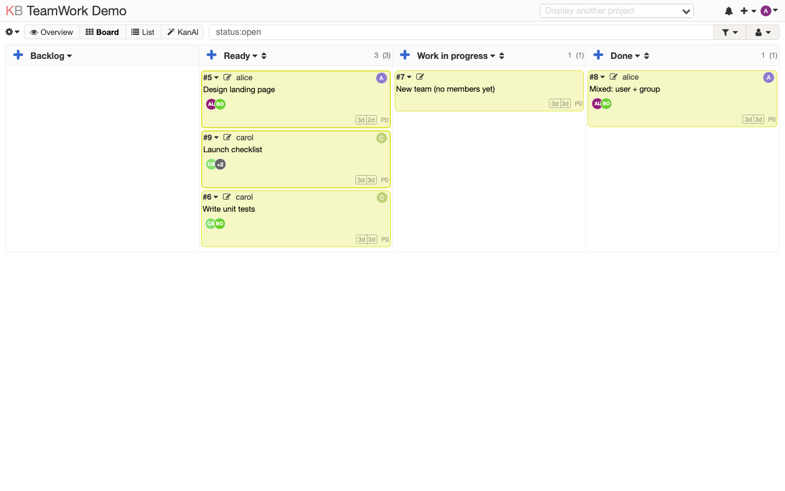
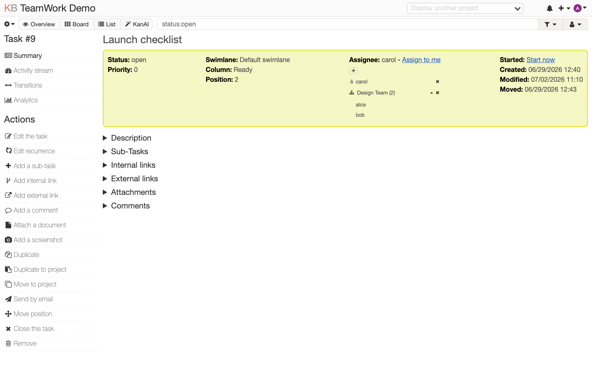
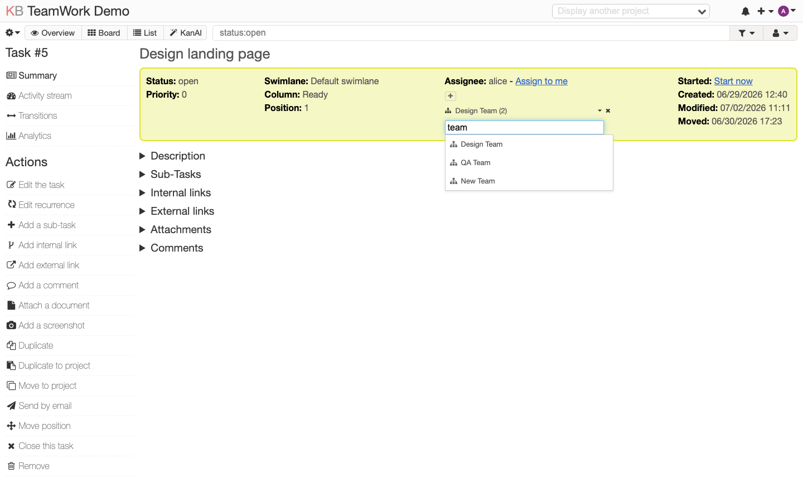
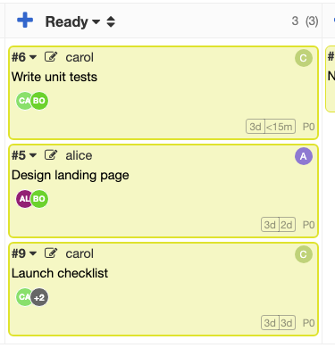
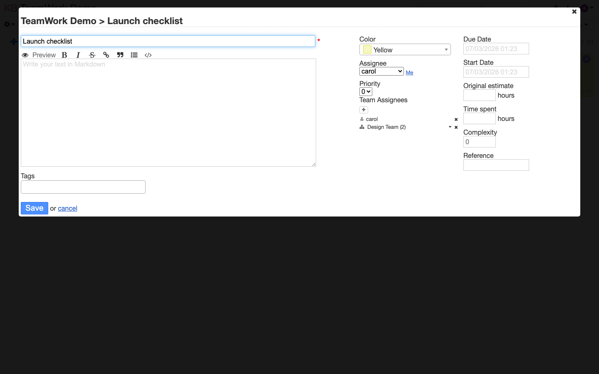
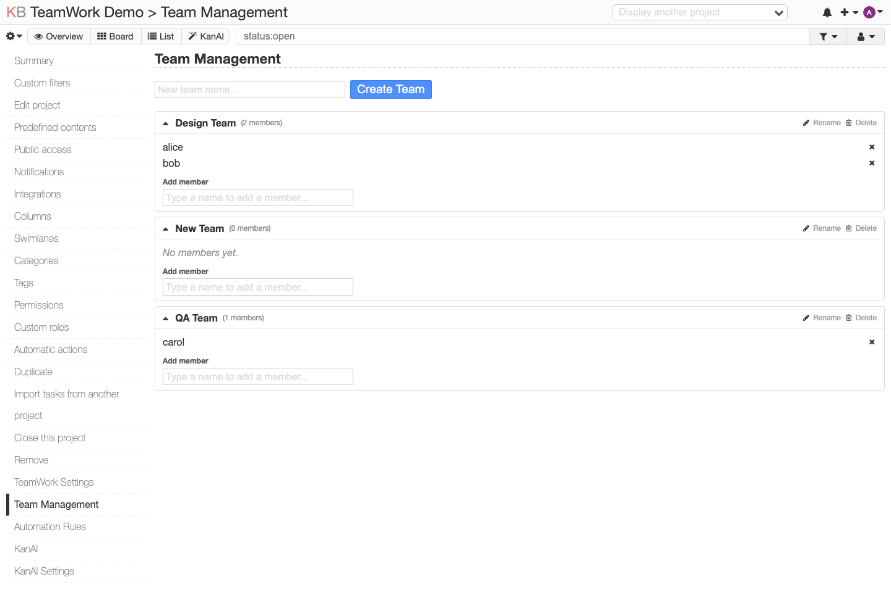
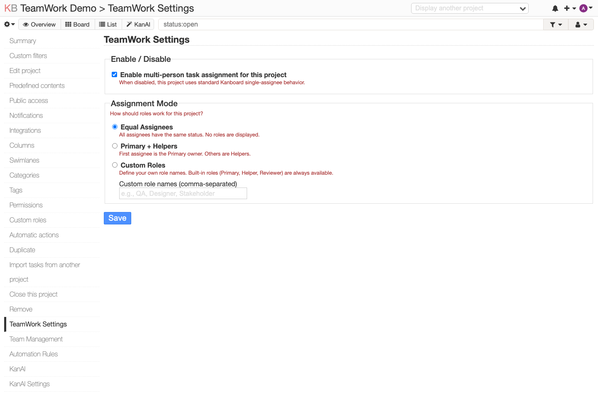
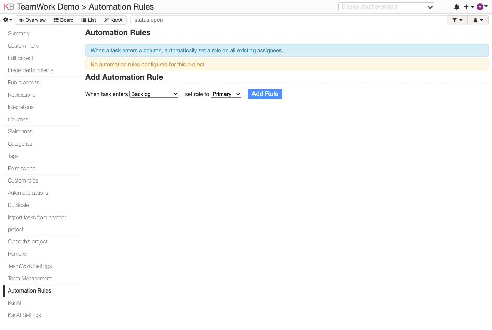
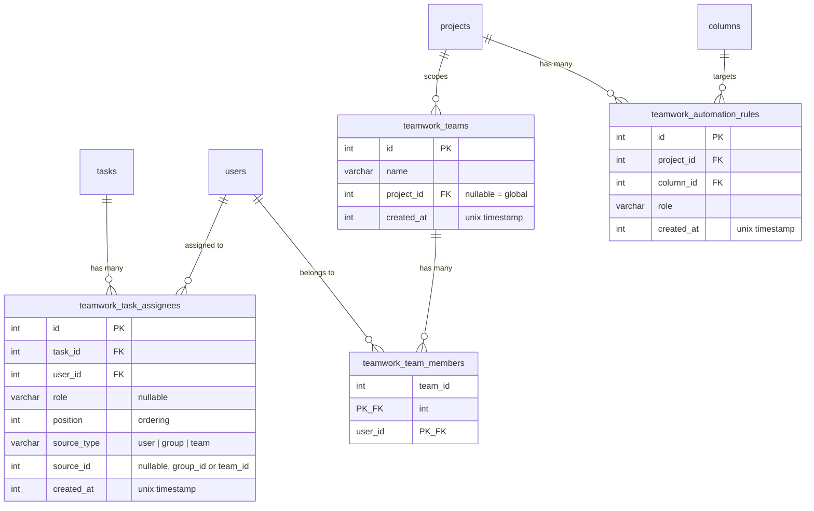

# TeamWork for Kanboard


**Multi-person task assignment plugin for Kanboard.**

TeamWork extends Kanboard's native single-assignee model with a full multi-assignee workflow. Assign individual users, Kanboard groups, and plugin-defined teams to any task. Assignees are visible everywhere: on board cards (avatar stacks), on the task detail page, and inside the task edit modal. The plugin can be enabled or disabled per project so teams that only need single-assignee behavior are not affected.

---

## Architecture


```mermaid
graph TD
    A[Plugin.php] -->|registers routes & hooks| B[Controllers]
    B --> B1[AssigneeController]
    B --> B2[SettingsController]
    B --> B3[TeamController]
    B --> B4[AutomationController]

    B1 --> C[Models]
    B3 --> C
    B4 --> C
    C --> C1[TaskAssigneeModel]
    C --> C2[TeamModel]
    C --> C3[AutomationRuleModel]

    A -->|template hooks| D[Templates]
    D --> D1[assignee/show]
    D --> D2[assignee/form_widget]
    D --> D3[assignee/picker]
    D --> D4[board/avatar_stack]
    D --> D5[settings/sidebar]
    D --> D6[settings/assignment_mode]
    D --> D7[team/index + members]
    D --> D8[automation/index]

    A -->|event listeners| E[Subscribers / Listeners]
    E --> E1[NotificationDispatcher]
    E --> E2[ColumnMoveListener]

    A -->|extends taskLexer| F[Filters]
    F --> F1[TaskTeamworkAssigneeFilter]
    F --> F2[TaskTeamworkRoleFilter]

    A -->|helper registry| G[BoardAvatarHelper]
```

---

## Features

### Multi-Assignee Management

- **Assign users** individually via a type-ahead search picker
- **Assign groups** (Kanboard native groups) -- all group members are added at once
- **Assign teams** (plugin-defined project teams) -- create reusable teams per project. Teams are **live-linked**: a team shows on the card by its own name (even when it has no members yet), and adding or removing a member of the team updates every card the team is assigned to
- **Remove** individual assignees, entire groups, or entire teams with one click
- **Primary assignee sync** -- Kanboard's native `owner_id` stays in sync with the assignee list, but conservatively: an existing assignment is never changed by team or group edits. The owner only changes when the task had no owner yet (first assignee is promoted) or when the current owner is removed from the task (next assignee takes over, or unassigned when none remain)

### Board Integration -- Avatar Stacks

- Colored avatar circles on every board card showing assigned members
- Overflow indicator (`+N`) when a task has more than two assignees
- Displayed on both private and public boards
- Assignee widget embedded in the task edit modal (card popup) for quick management without leaving the board

### Three Assignment Modes

Each project can independently choose one of three modes:

| Mode | Behavior |
|---|---|
| **Equal Assignees** | No roles; everyone has equal status (default) |
| **Primary + Helpers** | First assignee is Primary, all others are Helpers |
| **Custom Roles** | Define your own comma-separated role names (QA, Designer, Stakeholder, etc.) |

Roles are clickable -- click a role label to change it via an inline dropdown.

When switching to Primary + Helpers mode, existing assignees are retroactively updated: position 1 becomes Primary, all others become Helpers (only where role is currently unset, making the operation idempotent).

### Automation Rules

- Auto-assign a role to all existing assignees when a task moves to a specific column
- Example: set every assignee's role to "Reviewer" when a task enters "Ready for Review"
- Triggers on both drag-and-drop column moves and API-driven updates
- Managed from the project settings sidebar under **Automation Rules**

### Notifications

- All multi-assignees receive notifications for: task updates, task close, column moves, position moves, swimlane moves, assignee changes, overdue tasks, comments, mentions, and subtask events
- Custom `teamwork.assignee.add` and `teamwork.assignee.remove` events notify affected users when they are added to or removed from a task
- Notification fan-out runs at priority -10, after Kanboard's built-in NotificationSubscriber

### Search and Filtering

- Extended `assignee:` filter includes TeamWork assignees (not just the native owner)
- New `role:` filter to find tasks by assignee role (e.g., `role:Primary`, `role:QA`)
- Works in board filters and the global search bar
- To get a "my tasks" view that includes tasks where you are a secondary assignee, search `assignee:me` (save it as a custom filter). Kanboard's built-in "My tasks" dashboard only lists tasks you own; see [Known limitations](#known-limitations)

### Per-Project Toggle

- Enable or disable TeamWork independently for each project
- When disabled: no avatar stacks, no team assignee sections, no sidebar links, no automation, no notification fan-out -- just vanilla Kanboard
- Enabled by default for backward compatibility
- Stored as `teamwork_enabled` in project metadata

---

## Screenshots

### Board View -- Avatar Stacks

Each task card shows colored avatar circles for all assigned members, with a `+N` overflow indicator.



### Task Detail Page

The task detail page displays a complete assignee list with a `[+]` button to add more people.



### Search Picker

Click `[+]` to open the type-ahead search. Start typing a name to filter users, groups, and teams.



Hover the `+N` badge to see the names of everyone not shown.



### Edit Modal (Card Popup)

The task edit popup includes a "Team Assignees" section for managing assignees without leaving the board.



### Team Management

Create project teams and manage their members. The member list and "Add member" field are shown by default. Empty teams are supported and still appear on cards.



### TeamWork Settings

Enable/disable multi-person assignment per project and choose an assignment mode.



### Automation Rules

Automatically set a role on all assignees when a task enters a chosen column.



---

## Known limitations

Honest notes on current behavior, so there are no surprises:

- **"My tasks" dashboard** lists only tasks you own (Kanboard's native query cannot be safely widened by a plugin). Use the `assignee:me` search filter (saved as a custom filter) to see every task where you are any assignee.
- **Task duplication, "duplicate/move to another project"** do not carry TeamWork assignees or team links; re-assign after copying. The native single assignee (`owner_id`) is preserved.
- **Kanboard groups** are expanded to their members at the moment you add them (a snapshot). Unlike plugin teams, later changes to a Kanboard group's membership do not propagate to cards.
- **Global teams** (not tied to a project) are not yet creatable from the UI.
- The `role:` filter matches an exact role name; there is no `role:none` yet.

---

## Installation

### Option 1: Git Clone

```bash
cd /path/to/kanboard/plugins
git clone https://github.com/k1bot2026/kanboard-plugin-teamwork.git TeamWork
```

The plugin folder **must** be named `TeamWork` (case-sensitive):

```text
plugins/
  TeamWork/
    Plugin.php
    ...
```

Open Kanboard in your browser. The plugin is detected automatically and database tables are created on first load. Verify by navigating to **Settings > Plugins** -- "TeamWork" should be listed.

### Option 2: Docker

Add the plugin to your Kanboard image:

```dockerfile
FROM kanboard/kanboard:latest
COPY plugins/TeamWork /var/www/app/plugins/TeamWork
```

Build and run:

```bash
docker build -t kanboard-teamwork .
docker run -d -p 8080:80 -v kanboard_data:/var/www/app/data kanboard-teamwork
```

Or with Docker Compose:

```yaml
services:
  kanboard:
    build: .
    ports:
      - "8080:80"
    volumes:
      - kanboard_data:/var/www/app/data
    restart: unless-stopped

volumes:
  kanboard_data:
```

### Option 3: Manual Upload

1. Download the source code as a ZIP from the [Releases page](https://github.com/k1bot2026/kanboard-plugin-teamwork/releases)
2. Extract into your Kanboard `plugins/` directory
3. Rename the extracted folder to `TeamWork`
4. Refresh Kanboard

---

## Configuration

### Enabling TeamWork for a Project

1. Open the project and go to **Project Settings** (gear icon)
2. In the sidebar, click **TeamWork Settings**
3. Check **Enable multi-person task assignment for this project**
4. Click **Save**

### Choosing an Assignment Mode

1. In **TeamWork Settings**, select one of:
   - **Equal Assignees** -- no roles, everyone is equal
   - **Primary + Helpers** -- first assignee is Primary, rest are Helpers
   - **Custom Roles** -- enter comma-separated role names
2. Click **Save**

### Creating Project Teams

1. In the project sidebar, click **Team Management**
2. Enter a team name and click **Create**
3. Expand the team and use the search box to add members
4. Teams can now be assigned to tasks just like individual users

### Setting Up Automation Rules

1. In the project sidebar, click **Automation Rules**
2. Select a target column and the role to apply
3. When a task moves into that column, all existing assignees receive the configured role

---

## Database Schema

The plugin creates four tables. Foreign keys cascade on delete so removing a task, user, project, team, or column automatically cleans up related rows.


```mermaid
erDiagram
    tasks ||--o{ teamwork_task_assignees : "has many"
    users ||--o{ teamwork_task_assignees : "assigned to"
    teamwork_task_assignees {
        int id PK
        int task_id FK
        int user_id FK
        varchar role "nullable"
        int position "ordering"
        varchar source_type "user | group | team"
        int source_id "nullable, group_id or team_id"
        int created_at "unix timestamp"
    }

    projects ||--o{ teamwork_teams : "scopes"
    teamwork_teams {
        int id PK
        varchar name
        int project_id FK "nullable = global"
        int created_at "unix timestamp"
    }

    teamwork_teams ||--o{ teamwork_team_members : "has many"
    users ||--o{ teamwork_team_members : "belongs to"
    teamwork_team_members {
        int team_id PK_FK
        int user_id PK_FK
    }

    projects ||--o{ teamwork_automation_rules : "has many"
    columns ||--o{ teamwork_automation_rules : "targets"
    teamwork_automation_rules {
        int id PK
        int project_id FK
        int column_id FK
        varchar role
        int created_at "unix timestamp"
    }
```

### Schema Versions

| Version | Tables Created |
|---|---|
| 1 | `teamwork_task_assignees`, `teamwork_teams`, `teamwork_team_members` |
| 2 | `teamwork_automation_rules` |

Migrations are defined in `Schema/Sqlite.php`, `Schema/Mysql.php`, and `Schema/Postgres.php`. Kanboard runs pending migrations automatically when the plugin loads.

---

## Access Control

| Controller | Action | Minimum Role |
|---|---|---|
| AssigneeController | all actions | Project Member |
| SettingsController | all actions | Project Manager |
| TeamController | index, searchMembers | Project Member |
| TeamController | create, rename, remove, addMember, removeMember | Project Manager |
| AutomationController | all actions | Project Manager |

---

## Project Structure

```text
TeamWork/
  Plugin.php                         Entry point: routes, hooks, event listeners, filters
  Asset/
    teamwork.css                     Plugin styles
    teamwork.js                      jQuery behaviors for AJAX interactions
  Controller/
    AssigneeController.php           Add/remove/search assignees
    SettingsController.php           Assignment mode and enable/disable toggle
    TeamController.php               Team CRUD and member management
    AutomationController.php         Column-move automation rules
  Model/
    TaskAssigneeModel.php            Assignee data access and owner_id sync
    TeamModel.php                    Team and member data access
    AutomationRuleModel.php          Automation rule storage
  Helper/
    BoardAvatarHelper.php            Batch-loads assignees for board card rendering
  Filter/
    TaskTeamworkAssigneeFilter.php   Extended assignee: search filter
    TaskTeamworkRoleFilter.php       New role: search filter
  Subscriber/
    NotificationDispatcher.php       Fan-out notifications to all multi-assignees
  Listener/
    ColumnMoveListener.php           Fires automation rules on column transitions
  Template/
    assignee/show.php                Assignee list on task detail page
    assignee/form_widget.php         Assignee widget in task edit modal
    assignee/picker.php              Type-ahead search picker
    board/avatar_stack.php           Avatar circles on board cards
    settings/sidebar.php             Sidebar links in project settings
    settings/assignment_mode.php     TeamWork settings page
    team/index.php                   Team management page
    team/members.php                 Team members partial
    automation/index.php             Automation rules page
  Schema/
    Sqlite.php                       SQLite migrations
    Mysql.php                        MySQL migrations
    Postgres.php                     PostgreSQL migrations
  Locale/
    en_US/translations.php           English translations
```

---

## Compatibility

| Requirement | Version |
|---|---|
| Kanboard | >= 1.2.46 |
| PHP | >= 7.4 |
| Database | SQLite, MySQL / MariaDB, or PostgreSQL |

---

## License

MIT License -- see [LICENSE](LICENSE) for details.

**Author:** [k1bot2026](https://github.com/k1bot2026)
